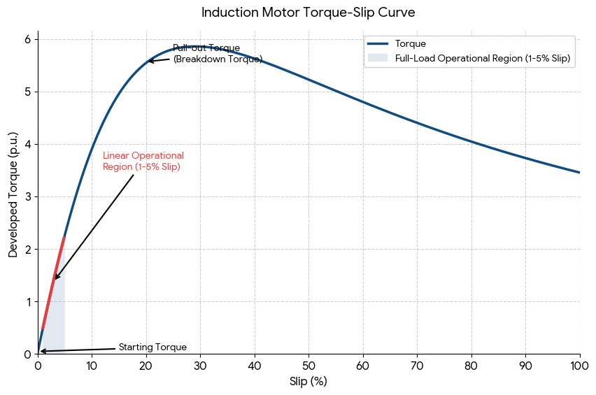

# AC Induction Motors

An AC induction motor is a stype of electric motor that runs on AC current and uses electomagnetic induction to create movement instead of using direct electical connections to its moving parts. When AC power flows int hte stator, the outer stationary ring of electromagnets connected to an AC power source, it builds a magnetic field that spins in a circle. The spinning magnetic field passes over the metal bars of the inner rotor (often called a "squirrel cage" because it looks like a metal exercise wheel for a pet) and forces an electric current inside them. The cre current inside the rotor creates its own magnetic field. The two magnetic fields push against each other and makes the rotor spin to try and catch up with the outer field.

## Motor Construction

### Stator Construction

When three winding sets are placed $120^\circ$ apart around the stator bore, they form the foundation of a three-phase AC induction motor. The specific mechanical spacing matches the timing of three-phase electrical power to create a smooth, self-starting rotation.The three separate alternating currents peak $120^\circ$ apart from one another coinciding with the three winding sets around the $360^\circ$ bore.

As Phase A peaks, it pulls the rotor. A fraction of a second later, phase B peaks and pulls the rotor further. Likewise, with phase C and back to phase A. The sequential peaking creates a magnetic field that physically rotates around the inside of the stator even thoug hte stator itself is completely stationary. The moving field automatically induces current in the rotor, making three-phase motors completely self-starting without the need for extra starting capacitors or switches.

The stator core is built from thin, laminated layers of silicon steel stacked together. These laminations prevent energy loss from heat (eddy currents[[^1]](#footnote-1)). Grooves cut along the inside of the stator bore where the isulated copper wire windings are tightly packed. A heavy outer housing (cast iron or aluminum) that holds the core in place and protects the internal components.

[^1]: Circular loops of electric current induced inside conductors by a changing magnetic field or relative motion. The generate an opposing magnetic field that creates drag and heat. A common use is magnetic braking to slow trains, trucks, and roller coasters safely without physical friction. In the stator core, they are highly undesireable and a direct cause of energy waste and excessive heat.

The inner bars of the rotor require no brushes or external connections because the rotor operates entirely via wireless electromagnetic induction. The rotor does not receive electricity from an outside power supply. The rotor bars generate their own electrical current purely from the shifting magnetic fields surrounding them.

Through Faraday's law of induction, as the magnetic field generated from the stators cuts across the metal rotor bars, a voltage and electric current is induced in them. The squirrel cage completes the circuit by the end rings forming a permanently closed, short-circuited loop entirely contained within the rotor. The induced current inside the short-circuited bars creats its own magnetic field that interacts with the stato's rotating magnetic field. This produces torque that forces the rotor to spin.

The mechancial simplicity and low maintainence of AC induction motors is why it dominates over 90% of industrial manufacturing applications. The motor essentially consists of only one moving assembly (the rotor and two bearings) with not commutators or slip rings and a solid uninsulated metal bars cast directly into steel laminations. The squirrel cage design can withstand massive centrifugal forces, heavy vibrations, and sudden mechanical shocks without breaking; no exposed electricall insulation to degrade means the motor can operate in heavily contaiminated, dusty, or wet industrial environments; open electrical contacts means there is zero risk of sparking and igniting the surrounding environment (chemical plants, oil refineries, and grain silos); and solid aluminum or copper rotor bars tolerate high heat cycles during heavy startup loads. Maintainance is minimal: there is no need for brushes or commutators. The only wearing parts are the mechanical bearings that can frequently last tens of thousands of hours on standard grease schedules.

## Rotating Magnetic Field

Three-phase stator currents produce a rotating magnetic field through a perfect synchronization of spatial placement and electrical timing. The three stator windings are physically placed $120^\circ$ apart around the motor frame and energized by three AC currents that are $120^\circ$ out of phase. Their individual magnetic fields combine into a single, constant amplitude net field vector that rotates smoothly in space at synchronous speed.

### How the field rotates

To create a rotating field, the motor relies on three different phases of AC current: phase A (the reference point a $0^\circ$), phase B (offset $120^\circ$ from phase A), and phase C (offset $240^\circ$ from phase A and $120^\circ$ from phase B). Each phase supplys three independant coil windings wrapped around the stator core, spaced exactly $120^\circ$ apart around the circular core. The combination of the electrical and geometric offsets produce the rotating field.

Each individual coil can only produces a magnetic field that pulses back and forth along its own fixed physical axis. Utilizing the currents peaking at different times, the sum of the three pulsating vectors behave like a spinning arrow.

1. At $0^\circ$: Phase A peaks positively

    - Currents: Phase A is at its maximum positive value. Phases B and C are both negative and at half-strength.

    - Fields: Phase A pulls the magnetic field strongly toward the $0^\circ$ physical axis. Phase B and C push weakly away from their respective physical axes.

    - Net Vector: The net field points directly towards $0^\circ$.

2. At $120^\circ$: Phase B peaks positively

    - Currents: One-third of an electrical cycle later, Phase B reaches its maximum positive value. Phases A and C are at half-strength negatively.

    - Fields: The primary magnetic pull shifts entirely over to the Phase B coil.

    - Net Vector: The net field smoothly swings around and now points toward $120^\circ$.

3. At $240^\circ$: Phase C peaks positively

    - Currents: Phase C reaches its maximum positive value. Phase A and B drop to half-strength megative.

    - Fields: The primary magnetic pull is towards the Phase C coil.

    - Net Vector: The total net field swings further and points directly towards $240^\circ$.

While individual fields constantly grow, shrink, and reverse direction, their trigonometric combination yields a mathematical constant. Using vector addition, if $B_m$ is the peak magnetic field of a single phase, the net magnetic field ($B_{net}$) at any given instant is always 1.5 times the maximum field of an individual coil:

$$B_{net} = 1.5 \times B_m$$ [[^2]](#footnote-2)

[^2]: The time-varying magnitudes of the magnetic fields, oscillating at angular frequency $\omega$, are shifted $120^\circ$ in time:

    $$B_A(t) = B_m \cos (\omega t)$$

    $$B_B(t) = B_m \cos (\omega t - 120^\circ)$$

    $$B_C(t) = B_m \cos (\omega t - 240^\circ)$$

    The net magnetic field vector $\vec B_{net}(t)$ is found by breaking each phase into components x and y:

    $$\vec B_A(t) = B_m \cos (\omega t) \hat i + 0 \hat j$$

    $$\vec B_B = B_m \cos (\omega t - 120^\circ)(-{1 \over 2}) \hat i + B_m \cos (\omega t - 120^\circ)({\sqrt 3 \over 2}) \hat j$$

    $$\vec B_C(t) = B_m \cos (\omega t - 240^\circ)(-{1 \over 2}) \hat i + B_m \cos (\omega t - 240^\circ)(-{\sqrt 3 \over 2}) \hat j$$

    Summing all three equations and isolating the $\hat i$ components yields:

    $$B \hat i = B_m[\cos(\omega t)-{1\over2}\cos(\omega t-120^\circ)-{1\over2}\cos(\omega t-240^\circ)]$$

    Applying trig identity $\cos(\alpha-\beta) = \cos\alpha\cos\beta+\sin\alpha\sin\beta$:

    $$B \hat i = B_m[\cos(\omega t)-{1\over2}(-{1\over2}\cos(\omega t)+{\sqrt3\over2}\sin(\omega t))-{1\over2}(-{1\over2}\cos(\omega t)-{\sqrt3\over2}\sin(\omega t))]$$

    Distributing constants and cancelling out $\sin(\omega t)$ terms yields:

    $$B\hat i=B_m[1+{1\over4}+{1\over4}]\cos(\omega t) = 1.5B_m\cos(\omega t)$$

    A similar derivation is performed for the $\hat j$ component showing that:

    $$\vec B_{net}(t) = 1.5B_m\cos(\omega t)\hat i+1.5B_m\sin(\omega t)\hat j$$

    The scalar magnitude is found via the Pythagorean theorem and identity: $\cos^2\theta + \sin^2\theta = 1$:

    $$\lvert\vec B_{net}\rvert = \sqrt{B_x^2+B_y^2}$$

    $$\lvert\vec B_{net}\rvert = \sqrt{(1.5B_m\cos(\omega t))^2+(1.5B_m\sin(\omega t))^2}$$

    $$\lvert\vec B_{net}\rvert = \sqrt{2.25B_m^2(\cos^2(\omega t)+\sin^2(\omega t))}$$

    $$\lvert\vec B_{net}\rvert = \sqrt{2.25B_m^2(1)} = 1.5B_m$$

### Synchronus Speed

Because the magnitude never changes, the magnetic fields does not pulse or flicker. It glides in smooth, continuous circle at synchronous speed ($N_s$), which is dectated by the power supply frequency ($f$) and the number of stator magnetic poles ($P$).: 

$$N_s = {120 \times f \over P}$$

Where:

- $N_s$ is the synchronous speed at which the net magnetic field vector rotates around the stator core. Measured in RPM.

- $f$ is the electrical frequency measured in Hertz (Hz).

- $P$ is the total pole count or number of individual magnetic poles (North and South) wound into the stator core per phase. It's always an even integer.

- 120 is a constant factor that scales seconds to minutes and converts individual magnetic poles into pairs.

Electrical frequency serves as the "clock rate" for the magnetic field. Every single complete AC cycle pushes the magnetic vector forward through one complete pair of North and South poles. The direct relationship between frequency and RPM means means that higher frequencies translates to a faster spinning magnetic field. Modern industrial systems use Variable frequency Drives (VFDs) to alter $f$. By electronically shifting the frequency to speed up or slow down a standard motor without changing its physical hardware.

The pole count represents the physical layout of the copper windings embedded inside the steel slots of the stator fram. A pole is an electromagnet configuration. The inverse relationship means more poles yield a slower rotational speed. Because pole counts must be even numbers, fixed-frequency industrial motors can only operate at specific, discrete synchronous speeds:

| Total Poles ($P$) | Poles Pairs | Synchronous Speed at 60 Hz | Common Application Type |
| --- | --- | --- | --- |
| 2 Poles | 1 Pair | 3600 RPM | High-speed centrifugal pumps, turbo blowers |
| 4 POles | 2 Pairs | 1800 RPM | Standard industrial conveyors, fans, compressors |
| 6 Poles | 3 Pairs | 1200 RPM | Heavy rock crushers, large hoists, mixers |
| 8 Poles | 4 Pairs | 900 PRM | Low-speed direct-drive ventilation, giant stamps |

### Synchronous vs. Actual Motor Speed

AC induction motors can never actually run at $N_s$. If the solid rotor spun at the exact same speed as the magnetic field, the rotor bars would experience zero relative motion. No magnetic lines of force would be cut. Meaning zero voltage would be induced, zero current would flow, and torque would be zero. The rotor must always lag (slip) slightly behind the synchronous speed. For example, a standard 4-pole motor with an $N_s$ of 1800 RPM will typically spin an actual full-load speed of around 1750 ROM.

### Reverse

Reversing any two phases changes the electrical time sequence of the currents relative to the spatial sequence of the windings. The inversion fips the mathematical direction of the vertical component, causing the net magnetic field to rotate backward.

In a standard three-phase system, the currents peak in a specific forward time order: A -> B -> C. Beacuse the stator windings are physically arranged clockwise around the frame in the same order, the peak magnetic pull naturally sweeps clockwise. Swapping the wires of Phase B and Phase C without changing their physical position on the stator frame changes the time order to: A -> C -> B, spinning the magnetica field in the opposite direction.

## Slip and Rotor Behavior

### Slip

Slip is the velocity lag of the rotor behind the spinning magnetic field or the normalized difference between synchronous speed and the rotor speed. The motor cannot run at synchronous because doing so means there would be no relative motion between the rotor and magnetic field, nothing would cut through the magnetic field, and no induced EMF or torque would be generated. Naturally, if an induction motor were to reach synchronous speed (receiving a downhill load, for example), the drop in torque would immediately lower the rotor's rotational velocity and restore current and torque as slip appears.

Slip is calculated as a dimensionless ratio or percentage using:

$$s = {N_s - N_r \over N_s}$$

where:

$s$: Slip is expressed as a decimal or multiplied by 100 for a percentage

$N_s$: Synchronous speed of the stator magnetic field (RPM)

$N_r$: Actual rotational speed of the physical rotor (RPM)

For standard industrial induction motors, typical full-load slip values range strictly between 1% and 5%. This narrow range indicated highly efficient operation. It's not a fixed value and scales dynamically with the physical torque demanded by the mechanical load. No-load conditions would have slip values at 0.5% or lower as the rotor spins nearly synchronous with the field. Increasing the load creates mechanical drag that slows the rotor down and increases slip. Higher slip increases relative motion, inducing more current to match the load. If slip approaches 15-20%, the motor reaches its maximum breakdown torque and will stall.

### Rotor Frequency

The relationship between the stator's electrical supply frequency ($f_s$) and the resulting frequency of the current induced in the rotor bars ($f_r$) is governed directly by the motor's slip (s):

$$f_r = s \times f_s$$

The frequency of the induced voltage and current in the rotor is determined strictly by relative speed. It depends entirely on how fast the stator's magnetic field is sweeping past the physical rotor bars.

At startup ($N_r = 0$), the rotor is completely stationary, so the stator field passes the rotor bars at full synchronous speed ($N_s$). Slip is 100%, the rotor frequency matches the line frequency exactly ($f_r = 100\% \times 60 \text{Hz}$), and the motor behaves exactly like a short-circuited transformer, inducing high-frequency, high-magnitude currents. 

At synchronous speed (theoretical $N_r = N_s$), slip would be zero, the rotor frequency would drop to zero, zero current is induced, and torque would vanish.

For a real-world motor operating at 3% slip in North America (60Hz supply):

$$f_s = 60 \text{Hz}$$

$$\text{Slip}(s) = 0.03$$

$$f_r = s \times f_s$$

$$f_r = 0.03 \times 60 \text{Hz} = 1.8 \text{Hz}$$

A frequency of 1.8Hz means the alternating current insides the coper rotor bars changes direction only 1.8 times per second. This is so slow that it mimics a slowly fluctuating direct current (near-DC). 

The drop in frequency from 60Hz at startup down to 1-2Hz at full loard drastically alters the internal electrical behavior of the rotor:

- The electrical opposition to current flow in the rotor comes from two sources: resistance and inductive reactance. Inductive reactance depends heavily on frequency ($X_r = 2\pi f_rL_r$). At startup, inductive reactance, $X_r$, is high, shich chokes the current and pushes it out of phase with the stator field, resulting in a poor startup power factor. At full load (1-2Hz), $X_r$ plumments to nearly zero. The rotor becomes almost entirely resistive.

- Because the near-DC frequency eliminates the inductive lag, the induced rotor current peaks at the exact same physical location as the maximum stator magnetic flus. The alignment is the reason why the motor produces maximum running efficiency and stable torque at low slip values despite the low frequency.

- Magnetic hysteresis [[^3]](#footnote-3) and eddy current losses inside the steel core of the rotor are heavily frequency-dependent. Because the rotor current drops to near-DC during normal operation, iron losses in the rotor become so tiny they are usually ignored in standard engineering efficiency calculations. 

[^3]: Magnetic hysteresis is the lag between an applied external magnetic field and the resulting magnetization of a ferromagnetic materal