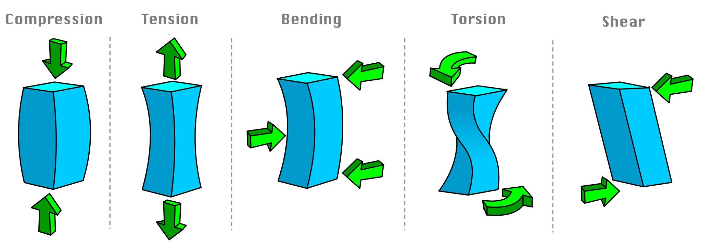
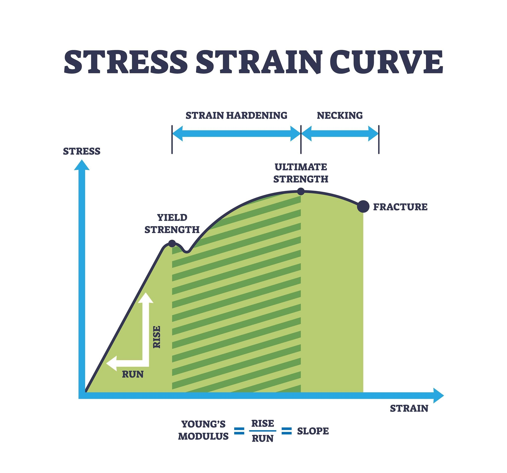
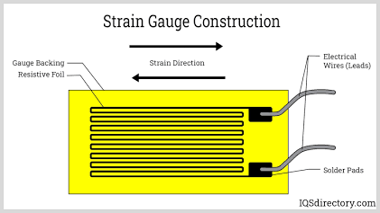

# Wheatstone Bridge & Strain Gauge

When a force is applied to the free end of a cantilever beam[[^1]](#footnote-1), it causes the beam to bend, creating a strain gradient. The top surface experiences tension and the bottom experiences compression. In this project, a foil strain gauge is mounted on the top surface near the fixed base where strain is at its maximum. The deformation of the strain gauge will cause a minor change in its resistance that will unbalance the wheatstone bridge. Normally too small to yield quantifiable data to an Arduino, an LM358 op-amp is used to amplify the microvolt readings into high resolution readings in the voltage range.

[^1]: A cantilever beam is a horizontal structural element that is firmly fixed or anchored at one end only while the other end remains completely free and unsupported in open space.

## Stress and Strain

At the most fundamental level, mechanics of materials comes down to cause and effect. Stress is the cause (the internale forces acting within a material) and strain is the effect (how the material physically deforms in response).

### Stress ($\sigma$)

Stress measures the intensity of the internal force inside an object when an external force (load) is applied to it. It is defined as the applied force ($F$) divided by the cross-sectional area ($A$) of the object:

$$\sigma = {F \over A}$$

Resulting in units of $\text {N} / \text {m} ^2$ or Pascals (Pa). Typically, expressed in units of Megapascals (MPa) or Gigapascals (GPa) because a Pascal is a tiny amount of pressure and the values for structural materials are so large.

**Note:** Stress cannot be measured. It's a mathematical concept. It is impossible to place a sensor onto an internal imaginary plane. The observable effect of stress is strain.

### Strain ($\epsilon$)

Strain is the measure of how much an object has deformed relative to its original size. Stretching a 10-inch rubber band by 1 inch stains is a specific amount while stretching a 100-inch bunge cord by 1 inch strains it by a much lower amount.

Strain is the change in length ($\Delta L$) divided by the original length ($L$):

$$\epsilon = {\Delta L \over L}$$

Strain is a dimensionless number. It's often express as a percentage or in "microstrain" (parts per million) for rigid materials like metal or concrete.

### Hooke's Law & Young's Modulus

For most structural materials, applying stress yields a proportional amount of strain. Pulling twice as hard stretches twice as much. This linear relationship is called Hooke's Law:

$$\sigma = E \cdot \epsilon$$

The constant $E$ is Young's Modulus (or the Modulus of Elasticity). It represents the intrinsic "stiffness" of a specific material. Steel has a very high Young's Modulus while rubber has a very low one.

Here is a table of common materials across the spectrum from highly elastic to profoundly rigid.

| Material | Young's Modulus (GPa) | Material Category | Practical Characteristics |
| --- | --- | --- | --- |
| Rubber (natural) | 0.01 - 0.1 | Elastomer | Extremely compliant; deforms massively under very little load. |
Teflon (PTFE) | 0.5 | Polymer | Soft, pliable plastic; easily deforms permanently if pushed past its low yield point |
Nylon | 2 - 4 | Polymer | Tough but flexibl; used in ropes and gears where slight yielding absorbs shock. |
| Wood (Pine, along grain) | ~10 | Natural Composite | Highly directional stiffness; much stiffer along the grain than across it. |
| Concrete (Compressive) | ~30 | Ceramic/Composite | Good stiffness under compression, but tears apart easily under tension without steel reinforcement | 
| Glass (Window) | 50 - 90 | Amorphous Solid | Stiff but perfectly brittle; has virtually no plastic region on a stree-strain curve before shattering |
| Aluminum (6061 Alloy) | ~69 | Metal | Very lightweight with moderate stiffness; roughly a third as stiff as steel |
| Bronze/Brass | 100 - 120 | Metal Alloy | Moderately stiff; often used in instruments and maritime fittings. |
| Structural Steel (A36) | 200 | Metal Alloy | The gold standard for structural engineering. Highly stiff with a very predeictable linear elastic region. |
| Tungsten | 400 - 410 | Refactory Metal | Exceptionally dense and stiff; used when deformation must be practically zero. |
| Diamond | 1050 - 1200 | Carbon Allotrope | The stiffest known natural bulk material. Covalent carbon bonds strongly resist to any stretching. |

### The Stress-Strain Curve

When a sample is put into an instron machine and pulled slowly until it snaps, the  data is used to plot the stress against the strain resulting in a curve that reveals the material's entire lifecycle under a (mostly static) load.[[^2]](#footnote-2)

[^2]: The diagram used for this section is most likely a mild or low-carbon steel. The small dip in the curve present at the yield point is a phenomenon not present on all other metals. Most metals transition smoothly from elastic to plastic deformation. 

1. Elastic Region (the linear region at the start): The material behaves like a spring. Removing the load in this region results in the material snapping back to its original shape. The slope of this line is Young's Modulus.

2. Yield Point: The critical threshold where the material stops bouncing back. Permanent damage is done to the internal crystal structure.

3. Plastic Region: The material is permanently deforming. Removing the load results in a partial rebound to its original shape. The unloading path is parallel to the linear elastic region on the stress-strain curve and ends at the new deformed position.

4. Ultimate Tensile Strength (The peak): The absolute maximum stress the material can handle before is begins to rapidly fail.

5. Fracture: The material snaps.

## Strain Gauges

A foil strain gauge is a small sensor glued to an object to measure how much it stretches or bends under pressure. As the object is strained, the tiny metal foil pattern inside the gauge stretches or shrinks, changing the electrical resistance and allowing for the calculation of physical stress on material.

### Construction

A bonded foil strain gauge consists of three main layers:

1. The Backing: A very thin, flexible insulating film usually made of polyimide or epoxy. Its purpose is to permanently adhere to the test surface using cyanoacrylate or epoxy adhesive to trasfer the physical strain directly from the beam to the foil without slipping.

2. The Foil Grid: A microscopic layer of metal allow (commonly an alloy of copper and nickel: Constantan) etched into a zigzag pattern. It's usually only a few micrometers thick.

3. Solder Pads: The contact points where the foil thickens so lead wires and be connected into a circuit.

The grid/zigzag pattern's purpose is to run the thin wire back and forth in parallel lines along the primary axis of strain to maximize the length of metal subjected to deformation. The wire is thicker at the ends to minimize the gauge's sensitivity to transverse strain.

### Resistance Change

The wire in the strain gauge responds tensile or compressive loads on the material its adhered to. The electrical resistance ($R$) of any wire is defined as:

$$R = \rho \cdot {L \over A}$$

Where:  
- $\rho$: The specific resistivity of the metal alloy.
- $L$: The length of the conductor.
- $A$: The cross-sectional area of the conductor.

When the strain gauge experiences tension: length increases, area decreases [[^3]](#footnote-3), and resistivity increases.[[^4]](#footnote-4)

Because the numerator goes up and the denominator goes does, the overall electrical resistance of the gauge increases under tension and decreases under compression.

[^3]: The Poisson effect is the tendancy of a material to expand or contract in directions perpendicular to the direction of an applied load. Stretching an object makes it thinner and bulge when compressed.

[^4]: The piezoresistive effect is the change in the electrical resistance of a material caused by mechanical stress or strain. The internal atomic structure of the material shifts and alters how easily electricity can flow through it.

### Gauge Factor

The gauge factor is the measure of how sensitive a gauge is or the ratio of the fractional change in electrical resistance to the fractional change in physical length (strain, $\epsilon$).

$$GF = {\Delta R / R_{nominal} \over \epsilon}$$

For most metallic foil gauges (like constantan), the gauge factor is approximately 2.0. This is actually a low sensitivity, meaning that stretching the gauge by 1% of it's total length ($\epsilon = 0.01$), the resistance changes by 2%. The change in resistance is usually a tiny fraction of a single ohm, which is why a wheatstone bridge and op-amp is required to convert the change into a measurable differential voltage.