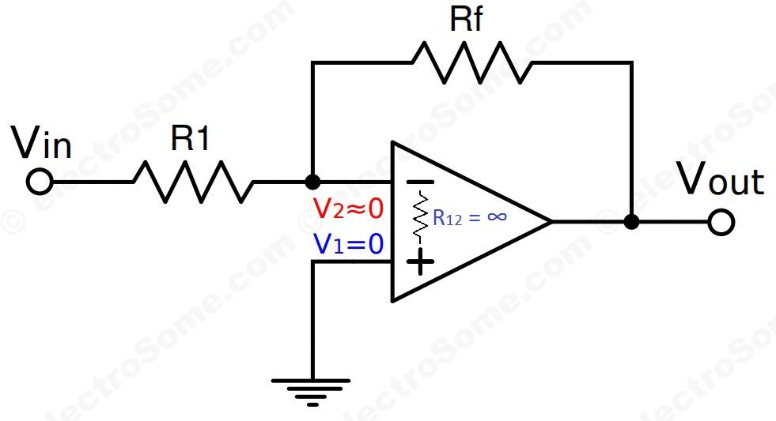

# Op-Amp Signal Amplifier

An op-amp (operational amplifier) is an electronic chip that makes weak electrical signals bigger. It has two inputs and one output. It works by measuing the difference between the two inputs and multiplying that value.

- Non-inverting Input (+): The positive input pin. A signal here keeps the same phase on the output.

- Inverting Input (-): The negative input pin. A signal here flips the phase of the output by 180 degrees.

- Output: The final amplified voltage signal.

- Power Supply: Pins for positive and negative DC voltage to power the chip.

- Gain: The measure of how much the op-amp multiplies the input signal.

## Ideal Op-Amp Characteristics

An ideal op-amp is a theoretical model used to simplify circuit design and analysis. While real-world op-amps have physical limitations, "ideal" op-amps make calculating circuit behavior incredibly easy. The core properties of an ideal op-amp and their real-world counterparts shaper how these components interact with electronic signals:

- Infinite open-loop gain: The raw chip amplifies the differential signal by a massive factor.

- Infinite input impedance: It draws virtually zero current into its input terminals without distortion or "loading down" the incoming sensor signal.

- Zero output impedance: It can supply as much current as needed to downstream components without losing voltage strength.

- Infinite bandwidth: The chip can amplify signals of any frequency from 0 Hz (DC current) to infinitely high radio frequencies with the exact same level of gain and zero time delay (phase shift).

### Real-World Op-Amps

**Op-amps' input impedance is finite** and allows small leakage currents to flow into or out of the input terminals. Real world op-amps are restricted by the semiconductor architecture used to build their internal input stages. The inputs are connected to the control gates or bases of a differential transistor pair. Depending on the type of transistors used, the input impedance behaviors change significantly:  

  - In standard op-amps, the input stage relies on base-emitter junctions. Because bipolar junction transitors (BJTs) require a continuous base current to operate, the input impedance is relatively low (1 MΩ and 10 MΩ).  
  - Modern high-impedance op-amps use JFETs or MOSFETs for their input stages. Since these gates are isolated by a layer of oxide or a reverse-biased junction, the input impendance is massive (1 GΩ to 1 TΩ).

While FET-input op-amps get incredibly close to "infinite" impedance, they still experience minuscule leakage currents that scale up dramatically with temperature. The timy current flowing though external external circuit resistors creates uninteded coltage drops that cause errors and shifts in the final output signal.

**An internal mismatch in the input transitors creates a non-zero input offset voltage.** This forces the op-amp to output an error voltage enven when the inputs are perfectly identical. Real-world op-amps are integrated circuits containing dozens of microscopic components. Silicon manufacturing cannot achieve absolute perfection. Tiny differences in the doping levels, area sizes, and geometries of the internal differential input pair (BJTs or MOSFETs) create slight current inbalances. 

**Op-amps do not have infinite gain at any frequency.** Real op-amps have a large but finite open-loop DC gain (100,000 to 1,000,000) and this gain drops steadily as the signal frequency increases due to internal capacitance. The product of the open-loop gain and the frequency is a constant value: Gain-Bandwidth Product (GBW). If an op-amp has a GBW of 1 MHz, its gain drops to 1 at 1 MHz.As open-loop gain drops at higher frequencies, the circuit has less loop gain left to stabilize the output, leading to distortion and timing errors.

**Real-world op-amps contain an internal compensation capacitor used for stability and have a maximum speed at which its output voltage can change** called slew rate limit, measured in volts per microsecond (V/μs). An internal differential stage drives current to charge this capacitor. The current available from this stage has a strict maximum limit (tail current) causing the capacitor to charge at a fixed maximum speed. This bottleneck prevents the output voltage from changing any faster.  
In signal processing:  
- A perfectly vertical square wave fed into a real op-amp yields a trapezoidal wave output with slanted edges. The slope of the edges is equal to the op-amp's slew rate.  
- A sine wave requiring the output to change faster than the slew rate limit can have its peaks lose their curvature, signal distorted, and the output degrade into a triangle wave.

## Negative feedback in linear circuits

Op-amps are used with negative feedback in linear circuits because their open-loop gain is too high and unstable to be useful on its own. A typical real-world op-amp amplifies the difference between its inputs by 100,000 to 1,000,000 times. Without negative feedback, a small input signal in the μV range forces the output to slam instantly into the power supply rails turning the amplifier into a simple on/off switch.

Negative feedback feeds a portion of the output signal back into the inverting (-) input. This creates a self-correcting loop that fights against any massive changes at the output. This trades the massive, unpredictable open-loop gain for a lower, precise closed-loop gain set entirely by external resistors, keeps the output within the linear operating range instead of clipping at the supply rails, and forces the voltage at the inverting input to track the non-inverting input, keeping the differential input voltage near zero.

### Benefits from negative feedback

- Gain stability: Real op-amp internal gain changes with temperature and manufacturing. Negative feedback makes the circuit gain depend on stable external resistors.

- Wider bandwidth: An op-amp's bandwidth multiplies as its gain decreases. Lowering the gain allowd the circuit to linearize much higher frequencies.

- Reduced Distortion: The self-correcting loop instantly compensates for internal nonlinearities and changes in the internal components.

- Ideal impedance matching: It boots the nircuit's input impedance (drawing less current from the source) and lowers the output impedance (effortlessly driving heavy loads).

### Positive feedback

Positive feedback destabalizes the system, pushing the output to its limits by reinforcing and amplifying the input change. This is used in oscillators[[^1]](#footnote-1) and Schmitt triggers[[^2]](#footnote-2), but destroys linear amplification.

[^1]: An oscillator is a circuit that generates a continuous, periodic AC signal from a pure DC power supply wihout needing any external input signal. The positive feedback acts as an energy booster. Any tiny microscopic electrical noise present when the circuit powers up is fed back into the (+) input, amplified, and fed back again, rapidly building up the signal strength.

[^2]: A Schmitt trigger is a comparator circuit that uses positive feedback to implement hysteresis[[^3]](#footnote-3) (two distinct threshold voltages for switching). It eliminates noise in a slow-changing signal that hovers near the switching point. Instead of rapidly switching due to noise, the circuit must completely clear the HIGH or LOW threshold, turning noisy analog signals into clean square digital pulses.

[^3]: When a system's output depends not only on its current input, but also on its past history of inputs. 

## Virtual Ground

A virtual ground in an op-amp is a node that stays at zero volts without a physical connection to a real ground. This happens because of very high open-loop gain, negative feedback, and a grounded non-inverting input.

An op-amp naturally amplifies the difference between its two inputs ($V_+ - V_-$) buy its open-loop gain ($A_{OL}$). The fundamental equation for an op-amp is:

$$V_{out} = A_{OL} \times (V_+ - V_-)$$

Rearranging the equation to solve for the differential input gives:

$$V_+ - V_- = {V_{out} \over A_{OL}}$$

In real-world op-amps, $A_{OL}$ is massive (100,000 to 1,000,000 or more), while $V_out$ is strictly limited by the power supply rails. Because the small output voltage is divided by the colossal open-loop gain, the difference ($V_+ - V_-$) is forced to an incredibly small value (effectively zero):

$$V_+ - V_- \approx {5 \text {V} \over 100,000} = 0.00005 \text V \approx 0 \text V$$

Negative feedback creates a self-correcting loop that dynamically drives the output to whatever voltage is necessary to keep this difference near zero.

Because the differential input voltage is forced to near zero by the high gain and negative feedback, the two input terminals track each other perfectly: $V_- \approx V_+$. This phenomenon is called a virtual short because the voltages at both nodes are identical, yet the two terminals are completely isolated from one another internally. There is no physical wire or low resistance path connecting them. If the non-inverting terminal ($V_+$) is tied directly to 0 V (ground), the negative feedback loop forces the inverting terminal ($V_-$) to maintain a potential of 0 V as well (creating a specific condition call a virtual ground).

Even though the two terminals share the same voltage as if they were shorted, zero current flows between them or into the op-amp inputs. This is because the ideal op-amp possesses infinite input impedance ($R_{in} = \infty$). Real-world op-amps use internal field-effect transitors (FETs) or bipolar transistors (BJTs) at the inputs to physically block current. FET-input op-amps have input resistances in the teraohms, meaning the current entering the pin is a negligible few picoamperes. All external current is forced to navigate around the op-amp rather than through it.

The virtual short/ground simplifies circuit analysis by allowing the use of Kirchhoff's Current Law (KCL) at the inverting node without worrying about the internal complexity of the op-amp. Consider an inverting amplifier where $V_+$ is grounded (0V), an input resistor ($R_1$) connects the input signal ($V_{in}$) to $V_-$, and a feedback resistor ($R_f$) connects $V_{out}$ to $V_-$.

1. Since $V_+ = 0 \text V$, the virtual ground principle dictates that $V_- = 0 \text V$.

2. Because no current can enter the $V_-$ pin, the current flowing through the input resistor ($I_{in}$) must equal the current flowing through the feedback resistor ($I_f$).

3. KCL equation: $$I_{in} = I_{f}$$

4. Substitute Ohm's Law: $${V_{in} - V_- \over R_{in}} = {V_- - V_{out} \over R_f}$$

5. Set $V_- = 0$ $${V_{in} - 0 \over R_{in}} = {0 - V_{out} \over R_f} \implies {V_{in} \over R_{in}} = {-V_{out} \over R_f}$$

6. Solve for Closed-Loop Gain ($A_v$): $$A_v = {V_{out} \over V_{in}} = -{R_{f} \over R_{in}}$$

Wihout the concept of a virtual ground stabilizing $V_-$ at 0 V and blocking input current, deriving this clean, predictable gain equation would be mathematically unfeasible.