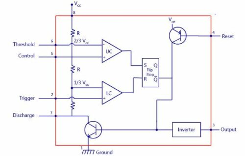
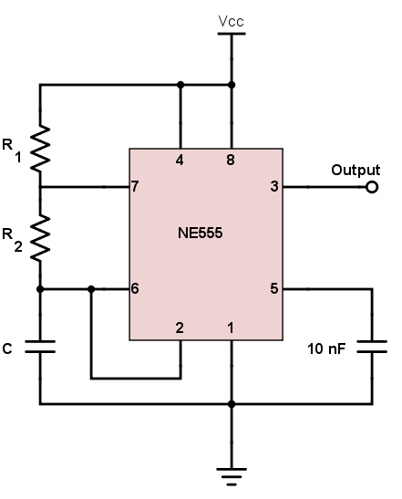
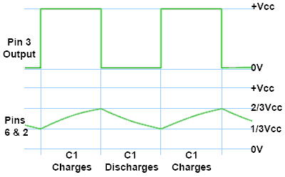

# 555 Astable Oscillator

A 555 timer IC wired in astable mode produces a continous square wave output with no microcontroller involvement. Frequency and duty cycle are set entirely by two resistors and one capacitor. Component swaps (resistors and capacitors) demonstrate the relationship between component values and output waveform directly on an oscilloscope or blinking LED.

## 555 Timer Internal Architecture

A standard 555 timer chip contains a resistanec voltage divider, two voltage comparators, an SR flip-flop, discharge transistor, output stage.

The voltage divider consists of three identical $5\text{k}\Omega$ resistors connected in series between the power supply ($V_{cc}$) and ground (This is widely cited as the origin of the "555" name). The resistors divide the supply voltage to establish two critical internal reference points:

- Lower Reference: ${1 \over 3} V_{cc}$

- Upper Reference: ${2 \over 3} V_{cc}$

The timer uses two analog comparators to constantly monitor external voltages against the internal resistor string. The trigger comparator (lower) compares the voltage at Pin 2 (trigger pin) against the ${1 \over 3} V_{cc}$ reference. When the trigger voltage drops below ${1 \over 3} V_{cc}$, this comparator outputs a HIGH signal. The threshold comparator (upper) compares the voltage at Pin 6 (threshold) against the ${2 \over 3}V_{cc}$ reference. When the external threshold voltage rises above ${2 \over 3}V_{cc}$, this comparator outputs a HIGH signal.

The outputs of the two comparators feed into a digital Set-Reset (SR) flip-flop that acts as the memory core of the timer, retaining its state until commanded to switch. Set (S) is driven by the trigger comparator and is SET on HIGH. Reset (R) is driven by the threshold comparator and is RESET on HIGH. Pin 4 (reset) is tied directly to the flip-flop's hardware reset line. Pulling this pin to ground overrides all comparator inputs and instantly resets the flip-flop.

The flip-flop uses its inverted output ($\overline Q$) to drive two separate components: the discharge transitor (pin 7) and push-pull output (pin 3). The discharge transistor is an NPN bipolar junction transistor with its collector tied to Pin 7 and emitter to ground. When the flip-flop is RESET (meaning $\overline Q$ is HIGH), this transistor turns ON, effectively shorting Pin 7 to ground. In a typical circuit, this immediately dumps the charge from an external timing capacitor. When the lip-flop is SET, the transistor turns OFF (open circuit), allowing the external capacitor to charge again. The Push-Pull output is a buffer stage that inverts the $\overline Q$ signal so the final output pin matches the primary state of the flip-flop. Standard bipolar 555 timers have strong output stages capable of sourcing or sinking up to 200 mA, meaning they can drive relays, LEDS, or small motors directly without external amplification.

### Logic Table

| Trigger (Pin 2) | Threshold (Pin 6) | Flip-Flop State | Discharge (Pin 7) | Output (Pin 3) |
| --- | --- | --- | --- | --- |
| $< {1 \over 3}V_{cc}$ | $<{2 \over 3} V_{cc}$ | SET | OFF(Open circuit) | HIGH ($V_{cc}$) |
| $> {1 \over 3}V_{cc}$ | $>{2 \over 3} V_{cc}$ | RESET | ON (Grounded) | LOW ($0 \text {V}$) |
| $> {1 \over 3}V_{cc}$ | $<{2 \over 3} V_{cc}$ | HOLD | No Change | No Change |

Note: $<{1 \over 3}V_{cc}$ and $>{2 \over 3} V_{cc}$ is an invalid operating condition that is intentionally avoided in circuit design. 

When the Trigger is $<{1 \over 3}V_{cc}$, the lower comparator outputs a HIGH signal to the Set pin of the flip-flop, telling the output to go HIGH. When the Threshold is $>{2 \over 3} V_{cc}$, the upper comparator outputs a HIGH signal to the Reset pin on the flip-flop, telling the output to go LOW. The standard Set-Reset flip-flop is being directed to tuen ON and OFF at the exact same time.

If pins 2 and 6 are manually isolated and fed two different external voltages to trigger this invalid state, the output is depends on the silicon architecture because different manufacturers construct the internal flip-flop slightly differently from one another. The final state is, more or less, unpredictable.

In practice, it's supposed to be impossible to achieve the invalid state. Common configuations like the Astable or Monostable modes have Pins 2 & 6 tied together or are monitoring the same RC timing capacitor.

## Astable Mode

In astable mode, the 555 timer operates as a free-running oscillator. It continuosly outputs a steady square wave without any external triggering. This hapens by forcing the timer's internal comparators into an endless loop of charging and discharging an external capacitor.

- Pin 2 (Trigger) and Pin 6 (Threshold) are tied together, monitoring the same voltage node: the top of the timing capacitor.

- The top resistor ($R_A$) connects from $V_{cc}$ to Pin 7 (Discharge).

- The lower resistor ($R_B$) connects from Pin 7 (Discharge) to the joined Pins 2 & 6.

- The capacitor ($C$) connects from Pins 2 & 6 to Ground.

- Pin 4 is tied to $V_{cc}$ to prevent accidental resets and Pin 5 is usually bypassed to ground with a small $10 \text {nF}$ capacitor to block electrical noise from interfering with the internal voltage divider.

The oscillation is entirely driven by the charging and discharging of the capacitor $C$ between the ${1 \over 3} V_{cc}$ and ${2 \over 3} V_{cc}$ thresholds.

### Two Phases of astable mode

**Phase 1**: Charging (Output is HIGH)

When the timer powers up, the capacitor is empty ($0 \text V$). Because $0 \text V$ is less than ${1 \over 3} V_{cc}$, the Trigger comparator fires, SETTING the internal flip-flop.

- The Output (Pin 3) goes HIGH.

- The Discharge transistor (Pin 7) turns OFF (acting as an open circuit).

Because Pin 7 is open, current flows from the power supply, down through $R_A$, through $R_B$, and into the capacitor. The voltage across the capacitor rises exponentially. The charging resistance is ($R_A + R_B$).

**Phase 2**: Discharging (Output is LOW)

The capacitor voltage climbs until it crosses ${2 \over 3} V_{cc}$. The moment it hits this mark, the Threshold comparator fires, RESETTING the flip-flop.

- The Output (Pin 3) goes LOW.

- The Discharge transistor (Pin 7) turns ON, shorting Pin 7 directly to ground.

Now, the path to $V_{cc}$ is blocked by the short to ground at Pin 7. The capacitor begins to dump its stored charge backwards.

### Charge/Discharge Timing

Because the charge path uses two resistors and the discharge path uses only one, the timing is asymmetrical. The behavior is calculated using the RC time constant equations for exponential charging (simplified by the natural log of 2 ($\approx 0.693$)).

- Time HIGH ($t_H$): $t_H = 0.693 \times (R_A + R_B) \times C$

- Time LOW ($t_L$): $t_L = 0.693 \times R_B \times C$

- Total Period ($T$): $T = t_H + t_L = 0.693 \times (R_A + 2R_B) \times C$

- Frequency ($f$): $f = {1.44 \over (R_A + 2R_B) \times C}$

The Duty cycle is the percentage of the time the output is HIGH versus the total period.

$$\text {Duty Cycle} = {t_H \over T} = {t_H \over t_H + t_L} = {R_A + R_B \over R_A + 2R_B} \times 100\%$$

In a standard astable configuration, the lowest possible duty cycle approaches 50% from 100% as $R_A \rarr 0$. Current must flow through both resistors while charging and only one while discharging. $(R_A + R_B) > R_B \implies t_H > t_L$. $R_A$ can not be 0 ohms because, the moment Pin 7 turns ON to discharge the capacitor, it creates a direct short-circuit from $V_{cc}$ to ground through the chip. This will draw excessive current and destroy the IC.

**Bypassing the 50% limit**

The capacitor has to charge and discharge through completely independent routes to achieve a duty cycle of 50% or lower using a signal diode (like a 1N4148) in parallel with $R_B$ with the anode facing Pin 7 and cathode facing Pin 6.

          [ Vcc ]
             │
           [RA]
             │
             ├─────── Pin 7 (Discharge)
             │
           ┌─┴─┐
           │   ▼  Diode (Bypasses R2 during charge)
          [RB] │
           │   │
           └─┬─┘
             ├─────── Pin 6 / Pin 2 (Capacitor node)
           [ C ]
             │
           [GND]

During the charging phase, current bypasses $R_B$ entirely by flowing through the diode. The capacitor charges through **only** $R_A$. During the discharge phase, the diode blocks the current, forcing the capacitor to empty through **only** $R_2$. The duty cycle becomes $D = {R_A \over (R_A + R_B)} \times 100\%$. A 50% duty cycle is achieved when $R_A = R_B$ and duty cycles less than 50% are achieved with $R_B > R_A$.

