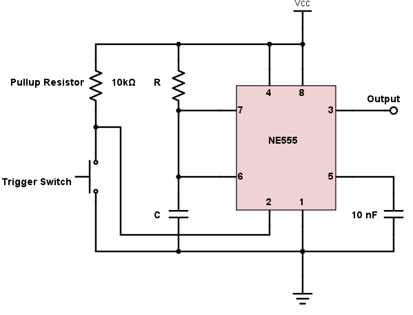
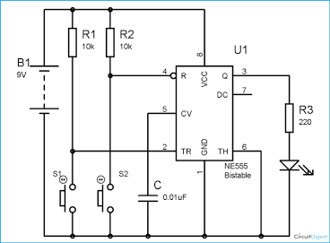

# 555 Monostable and Bistable Modes

## Monostable Mode (one stable state)

In monostable mode, the circuit remains in its single stable state (LOW) indefinitely until an external pulse triggers it. Upon receiving a trigger, the output swtches to HIGH for a time period ($t$) before automatically falling back to LOW.

**Wiring Configuration**

- Pin 2 (trigger): Tied to $V_{cc}$ through a $10\text{ k}\Omega$ pull-up resistor. A push-button connects Pin 2 to ground to send a negative trigger pulse.

- Pins 6 & 7 (Threshold and Discharge): Connected together and placed at the junction between timing resistor $R$ and timing capacitor $C$.

- Resistor $R$: Connected from $V_{cc}$ to Pins 6/7.

- Capacitor $C$: Connected from Pins 6/7 to ground.

- Pin 4 (reset): TIed directly to $V_{cc}$ to prevent accidental resetting.

- Pin 5 (control Voltage): Connected to ground via a $10\text{ nF}$ decoupling capacitor.

**How it works**

- Idle State: The internal flip-flop is RESET. Pin 3 (output) sits are LOW (0V), and the internal Discharge transistor (Pin 7) is ON, holding capacitor (C) shorted to ground.

- Triggering: When the button on Pin 2 is pressed, the voltage drops below ${1 \over 3} V_{cc}$. The lower comparator fires and SETS the flip-flop.

- Active Pulse: The output at Pin 3 goes HIGH, and Pin 7 turns OFF (opens). Capacitor C begins charging through resistor R toward $V{cc}$.

- Auto-Reset: As soon as the capacitor voltage reaches $2 \over 3 V_{cc}$, the Threshold comparator fires, RESETTING the flip-flop. Output drops back to LOW, Pin 7 turns ON, and C dumps its charge instantly to ground.

The length of the output pulse depends solely on R and C:

$$t = 1.1 \times R \times C$$

**Wiring Configuration**

- Pin 2 (Trigger/SET): Pulled HIGH to $V_{cc}$ with a $10\text{ k}\Omega$ resistor and connected to ground through Push-Button 1.

- Pin 4 (Reset/RESET): Pulled HIGH to $V_{cc}$ with a $10\text{ k}\Omega$ resistor and connected to ground through Push-Button 2.

- Pin 6 (Threshold): Tied directly to ground (0V). This disables the upper comparator so the timer never auto-resets based on voltage.

- Pin 7 (Discharge): Left completely unconnected.

- Pin 5 (Control voltage): Connected to ground via a $10\text{ nF}$ capacitor.

**How it Works**

- Setting the Latch: Pressing Push-Button 1 pulls Pin 2 to $0 V (<{1 \over 3} V_{cc})$. The filp-flop is SET, driving Pin 3 HIGH. It stays HIGH even after releaseing the button.

- Resetting the Latch: Pressing Push-Button 2 pulls Pin 4 to 0V. The flip-flop is REST, driving Pin 3 LOW. It stays LOW even after releaseing the button.

## Example: 555 Timer cirsuit that turns on an LED for 5 seconds

**Component Values**

The duration $t$ of the output pulse in monostable mode is defined as :

$$t = 1.1 \times R \times V$$

Where:

- $t$ = Output pulse time in seconds (5s)

- $R$ = Timing resistor in Ohms

- $C$ = Timing capacitor in Farads

Using a standard $100\,\mu\text{F}$ electrolytic capacitor,

$$R = {t \over 1.1 \times C} = {5 \over 1.1 \times 0.0001} = {5 \over 0.00011} \approx 45,455 (45.5 \text{k}\Omega)$$

(Exact resistance is achieveable with a potentiometer or "close enough" is obtainable through combining resistors).

Assuming a standard 9V power supply and a red LED ($V_{cc} = 9V, V_f \approx 2.0V, \text {target current} i_f \approx 15 \text{mA}$):

$$R_{LED} = {V_{cc} - V_f \over I_f} = {9V - 2.0V \over 0.015A} \approx 466 \Omega \rightarrow 470 \Omega$$